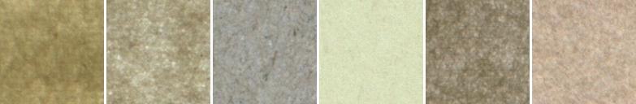
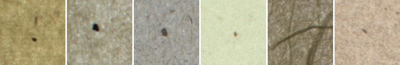
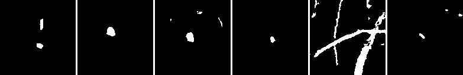

# PIPED: Paper ImPuritiEs Dataset

This repository contains the data used in the following paper:

Bianconi, F., Ceccarelli, L., Fernández, A., Saetta, S.A.
[A sequential machine vision procedure for assessing paper impurities](https://www.sciencedirect.com/science/article/pii/S0166361513002431) (2014) Computers in Industry, 65 (2), pp. 325-332.

Please make a reference to this work if you wish to use this dataset for your research activity.

## Contributors
[Francesco Bianconi](www.bianconif.net), [Luca Ceccarelli](https://www.linkedin.com/in/luca-ceccarelli-70523626/) and [Stefano Saetta](https://www.linkedin.com/in/saetta/)

## Keywords
Anomaly detection, Image classification, Image segmentation, Impurities, Paper, Surface inspection,  

## Organisation
The dataset contains images from 13 types (classes) of papers; each subfolder in the `data` folder represents one class. There are three subfolders for each class, each containing 48 images:

- `NoDefects` (contains patches without defects/impurities)

- `Defects` (contains patches with defects/impurities)

- `Defects/GroundTruth` (contains the manually-delineated segmentation of the impurities, i.e., the 'ground truth')

## Image acquisition and format
Image acquisition was carried out using a [Monster Dome Light](https://spectrumillumination.com/product-type/dome-lights/) illuminator and an industrial CMOS colour camera. Depending on the type of paper the acquisition was performed either in reflection or trans-illumination mode.

All the images are three-channel, lossless RGB bitmaps (.bmp). The size is 128 px × 128 px; the spatial resolution approximately 370 dpi.

Please refer to the original article for any further details.

## License
Distributed under Creative Commons Attribution 4.0 International ([CC BY 4.0](https://creativecommons.org/licenses/by/4.0/))

## Disclaimer
The information and content available on this repository are provided with no warranty whatsoever. Any use for scientific or any other purpose is conducted at your own risk and under your own responsibility. The authors are not liable for any damages - including any consequential damages - of any kind that may result from the use of the materials or information available on this repository or of any of the products or services hereon described.
